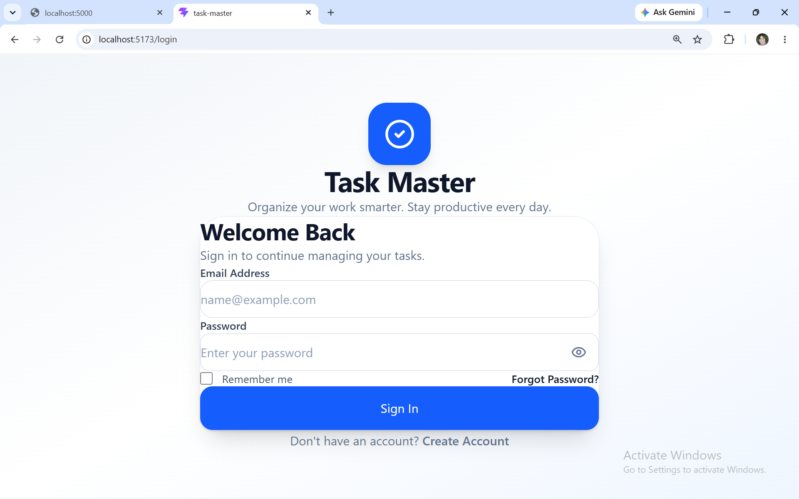
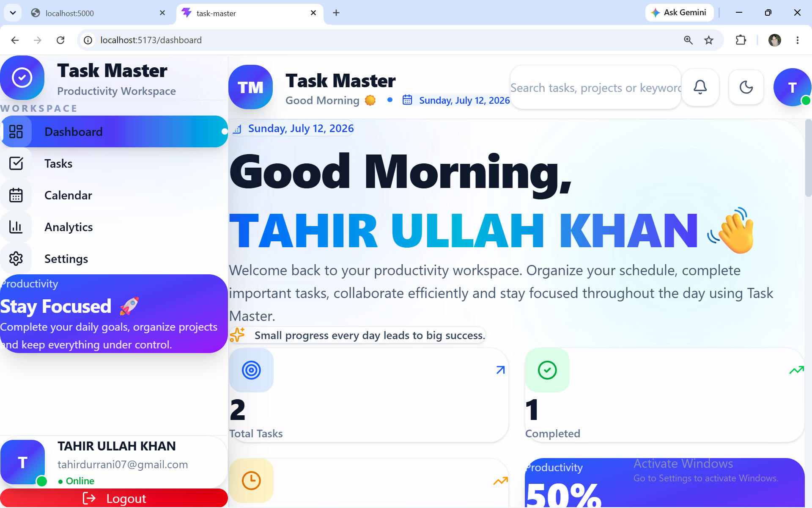
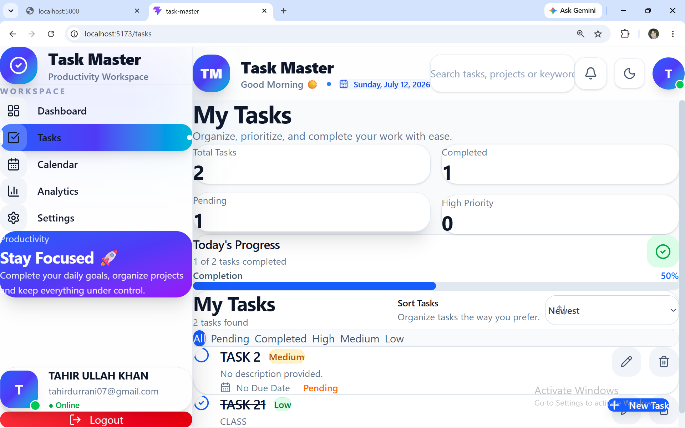
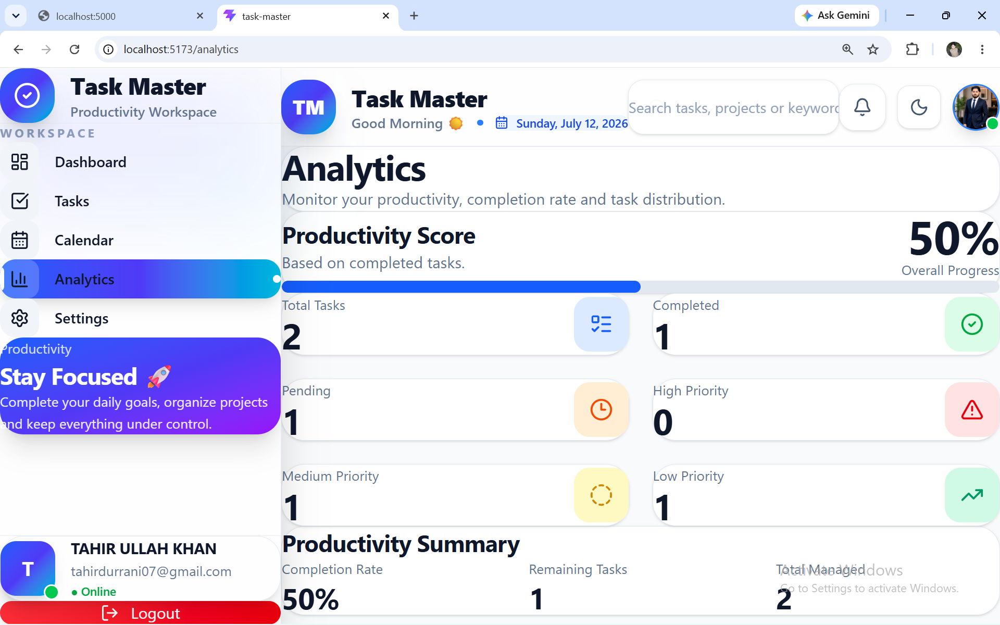
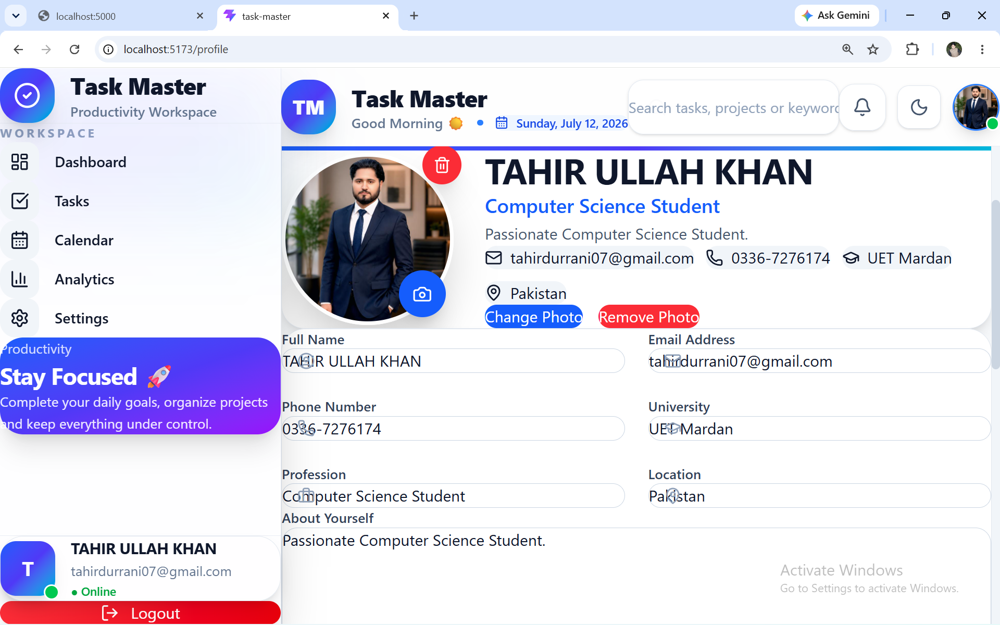
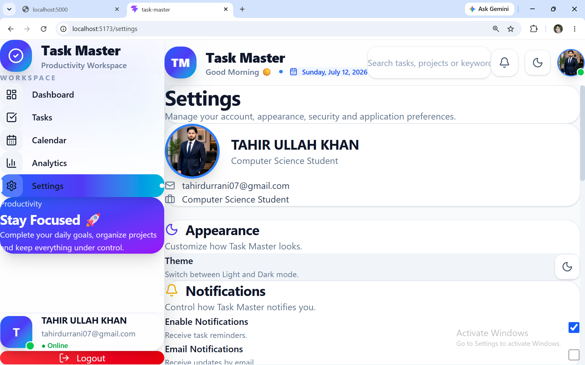
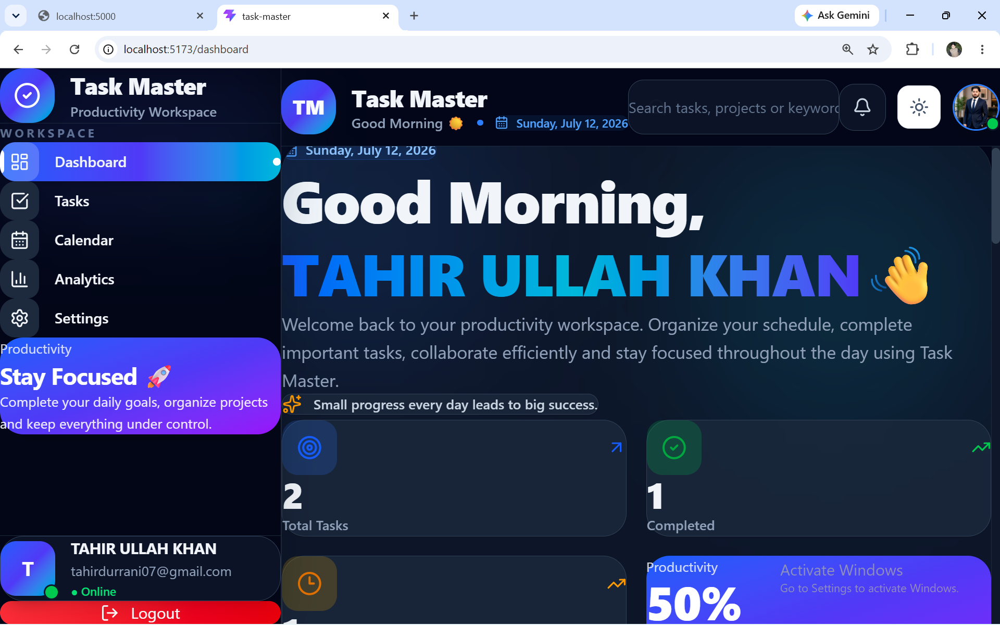
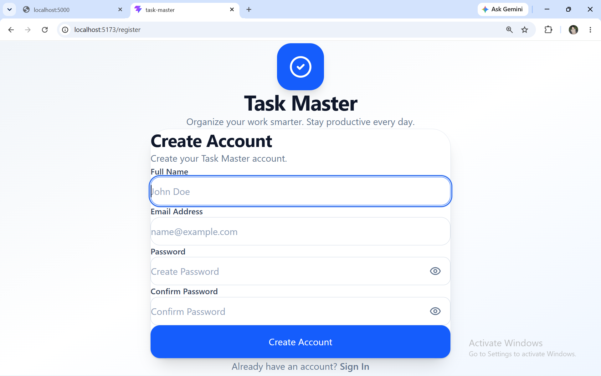

# 🚀 Task Master

<div align="center">


### Modern Full Stack Task Management Application

Organize • Prioritize • Track • Achieve

Built using **React, Vite, Tailwind CSS, Node.js, Express.js, MongoDB, and JWT Authentication**.

</div>

---

# 📖 Overview

Task Master is a modern full-stack productivity application that helps users efficiently organize daily tasks, monitor productivity, and securely manage personal information.

The application follows a clean Google-inspired design and provides a responsive interface for desktop and mobile users.

---

# ✨ Features

## 🔐 Authentication

- User Registration
- Secure Login
- JWT Authentication
- Remember Me
- Protected Routes
- Session Persistence
- Logout

---

## 👤 Profile Management

- Edit Profile
- Upload Profile Picture
- Update Personal Information
- Save to MongoDB
- Persistent User Data

---

## ✅ Task Management

- Create Tasks
- Edit Tasks
- Delete Tasks
- Mark Complete
- Search Tasks
- Filter Tasks
- Sort Tasks
- Priority Levels
- Due Dates
- Task Statistics

---

## 📊 Dashboard

- Productivity Analytics
- Statistics Cards
- Calendar Widget
- Recent Tasks
- Upcoming Tasks
- Recent Activity
- Responsive Dashboard

---

## ⚙️ Settings

- Dark / Light Theme
- Change Password
- Notification Preferences
- Export Tasks
- Data Management
- Account Information
---

# 🛠️ Tech Stack

## Frontend

- React 19
- Vite
- Tailwind CSS
- React Router DOM
- React Hot Toast
- Lucide React
- Recharts
- React Calendar

## Backend

- Node.js
- Express.js
- MongoDB
- Mongoose
- JWT Authentication
- Express Validator
- bcrypt.js
- dotenv
- CORS

---

# 📂 Project Structure

```text
task-master/
│
├── public/
│   └── screenshots/
│
├── src/
│   ├── api/
│   ├── assets/
│   ├── components/
│   │   ├── dashboard/
│   │   ├── layout/
│   │   ├── tasks/
│   │   └── ui/
│   │
│   ├── context/
│   ├── hooks/
│   ├── pages/
│   ├── routes/
│   ├── services/
│   ├── utils/
│   │
│   ├── App.jsx
│   └── main.jsx
│
├── package.json
└── README.md
```

---

# 🚀 Installation

## 1️⃣ Clone Repository

```bash
git clone <your-frontend-repository-url>
```

---

## 2️⃣ Open Project

```bash
cd task-master
```

---

## 3️⃣ Install Dependencies

```bash
npm install
```

---

## 4️⃣ Start Development Server

```bash
npm run dev
```

---

The application will start at:

```text
http://localhost:5173
```

---

# 📦 Main Dependencies

- react
- react-dom
- react-router-dom
- tailwindcss
- lucide-react
- react-hot-toast
- recharts
- react-calendar

---

# 🌟 Highlights

- Google-inspired UI
- Modern Glassmorphism Design
- Fully Responsive Layout
- Dark / Light Mode
- Beautiful Animations
- MongoDB Integration
- Secure JWT Authentication
- Profile Management
- Analytics Dashboard
- Smart Task Management
- Clean Architecture
- Professional Code Structure

---
# 📸 Application Screenshots

> Replace these placeholder images with your own screenshots after uploading them to:

```text
public/screenshots/
```

| Login | Dashboard |
|-------|-----------|
|  |  |

| Tasks | Analytics |
|-------|-----------|
|  |  |

| Profile | Settings |
|---------|----------|
|  |  |

| Dark Mode | Register |
|-----------|----------|
|  |  |

---

# 🎯 Future Improvements

The following features are planned for future releases:

- 📱 Progressive Web App (PWA)
- 📧 Email Verification
- 🔔 Push Notifications
- 👥 Team Collaboration
- 💬 Comments on Tasks
- 📎 File Attachments
- 🏷️ Task Labels & Categories
- 📈 Advanced Analytics
- ☁️ Cloud Storage Integration
- 🌐 Multi-language Support
- 📅 Google Calendar Integration
- 🤖 AI Task Suggestions

---

# 🤝 Contributing

Contributions are welcome!

If you'd like to improve this project:

1. Fork the repository
2. Create a new branch

```bash
git checkout -b feature-name
```

3. Commit your changes

```bash
git commit -m "Add new feature"
```

4. Push your branch

```bash
git push origin feature-name
```

5. Open a Pull Request

---

# 👨‍💻 Developer

**Tahir Ullah Khan**

🎓 BS Computer Science Student

🏫 University of Engineering & Technology (UET) Mardan

💻 Full Stack Web Developer

🚀 React • Node.js • Express • MongoDB • Tailwind CSS

---

# 📄 License

This project is licensed under the **MIT License**.

You are free to use, modify, and distribute this project for educational and personal purposes.

---

# ⭐ Support

If you like this project:

⭐ Star the repository

🍴 Fork the repository

🛠️ Contribute to improve it

---

<div align="center">

# Thank You ❤️

### Built with React, Tailwind CSS, Node.js, Express.js & MongoDB

**Task Master — Organize • Prioritize • Achieve**

© 2026 Tahir Ullah Khan. All Rights Reserved.

</div>